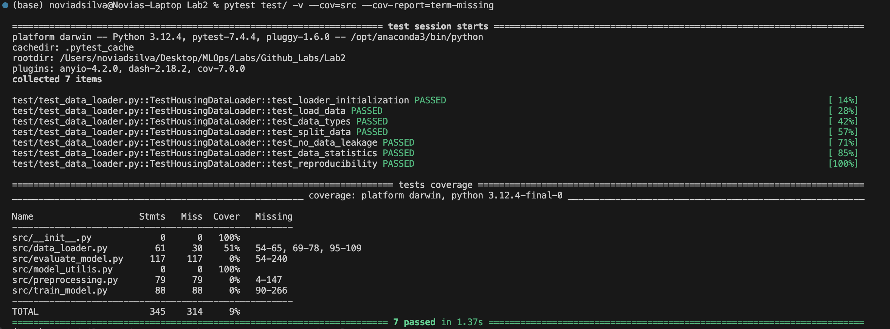
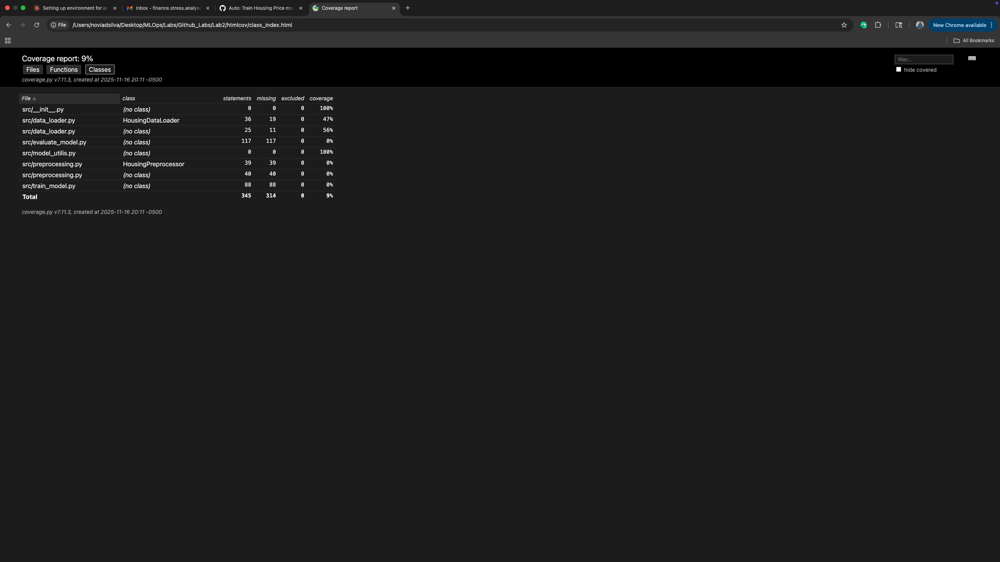
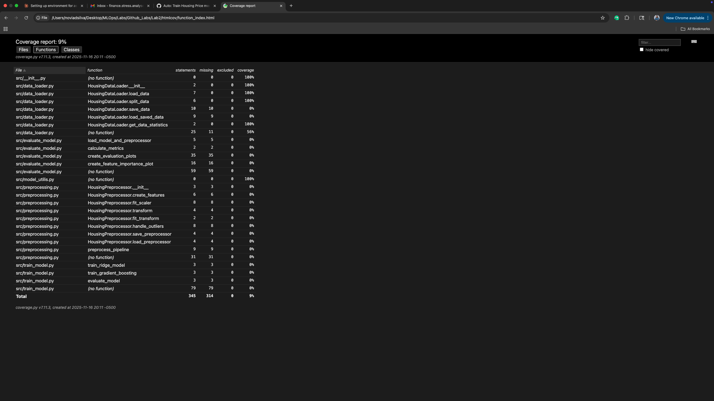

# Using GitHub Actions for Model Training and Versioning for California Housing Price Prediction

[](https://github.com/Novia-Dsilva/MLOPS_Assignment5_Github-Lab2/actions/workflows/model_pipeline.yml)
[](https://github.com/Novia-Dsilva/MLOPS_Assignment5_Github-Lab2/actions/workflows/pytest.yml)
[](https://github.com/Novia-Dsilva/MLOPS_Assignment5_Github-Lab2/actions/workflows/unittest.yml)

A production-ready MLOps pipeline demonstrating end-to-end machine learning workflow automation using GitHub Actions, MLflow, FastAPI, and Streamlit for California housing price prediction.

---

## Project Overview

This project showcases a **complete MLOps pipeline** for predicting California housing prices. Unlike traditional ML projects, this implementation emphasizes:

- **Automated Training**: GitHub Actions triggers model training on every push
- **Experiment Tracking**: MLflow logs all experiments, parameters, and metrics
- **Model Serving**: FastAPI provides REST endpoints for predictions
- **Interactive Dashboard**: Streamlit enables real-time predictions and visualization
- **Version Control**: Every model is versioned with timestamps
- **CI/CD Integration**: Full automation from training to deployment

### Dataset

**California Housing Dataset** (from scikit-learn)
- **Source**: 1990 California census data
- **Samples**: 20,640 observations
- **Features**: 8 numerical features
  - `MedInc`: Median income in block group
  - `HouseAge`: Median house age in block group
  - `AveRooms`: Average number of rooms per household
  - `AveBedrms`: Average number of bedrooms per household
  - `Population`: Block group population
  - `AveOccup`: Average number of household members
  - `Latitude`: Block group latitude
  - `Longitude`: Block group longitude
- **Target**: Median house value (in $100,000s)

---

---

## 🆕 Key Enhancements from Original Lab

This implementation significantly extends the original GitHub Actions lab. Here's a detailed comparison:

### Comprehensive Comparison Table

| Component | Original Lab | This Implementation | Enhancement Details |
|-----------|-------------|---------------------|---------------------|
| **Dataset** | Synthetic data (`make_classification`) | California Housing Dataset | Real-world dataset with 20,640 samples, 8 features from 1990 census data |
| **Model Type** | Random Forest Classifier | Gradient Boosting Regressor | Advanced regression model with hyperparameter tuning (n_estimators=100, learning_rate=0.1, max_depth=3) |
| **Problem Type** | Classification | Regression | Predicting continuous values (house prices) instead of classes |
| **Data Preprocessing** | None | Complete preprocessing pipeline | Feature engineering (3 new features), standard scaling, outlier detection |
| **Evaluation Metrics** | F1 Score only | 4 comprehensive metrics | RMSE, MAE, R² Score, MAPE with visual analysis |
| **Experiment Tracking** | None | MLflow integration | Full experiment tracking, parameter logging, model registry, web UI at localhost:5000 |
| **Model Serving** | None | FastAPI REST API | 6 endpoints including /predict, /batch_predict, /health, /model_info with Swagger docs |
| **Dashboard** | None | Streamlit Dashboard | 4-page interactive dashboard with live predictions, model comparison, visualizations |
| **Visualizations** | None | Comprehensive plots | Evaluation plots (4 subplots), feature importance, residual analysis, performance trends |
| **GitHub Actions Workflows** | 1 workflow | 4 workflows | model_pipeline.yml, scheduled_training.yml, pytest.yml, unittest.yml |
| **Scheduled Training** | None | Daily automated retraining | Cron schedule (0 0 * * *) for periodic model updates |
| **Testing Framework** | None | pytest + unittest | 4 test files covering data loading, preprocessing, and API with 25+ tests |
| **Test Automation** | None | Automated testing on push/PR | Separate workflows for pytest and unittest with coverage reporting |
| **Documentation** | Basic README | Comprehensive documentation | Complete README with badges, API docs, usage guides, architecture diagrams, screenshots |
| **Screenshots** | None | 11 screenshots | Visual proof of working pipeline: dashboards, workflows, tracking, API |
| **Artifacts** | None | Downloadable artifacts | Models, metrics, plots packaged and stored for 30-90 days |
| **Code Coverage** | None | pytest-cov integration | HTML coverage reports showing test coverage percentage |
| **API Documentation** | None | Auto-generated Swagger UI | Interactive API documentation with try-it-out feature |
| **Feature Engineering** | None | 3 engineered features | RoomsPerHousehold, BedroomsRatio, PopulationPerHousehold |
| **Model Versioning** | Basic timestamp | Advanced versioning | Timestamp-based with preprocessor, feature info, and metrics tracking |
| **Badges** | None | 6 status badges | Model Pipeline, Scheduled Training, pytest, unittest, Python version, License |
| **Deployment Ready** | No | Yes | Complete FastAPI + Streamlit + MLflow stack ready for production |

### Technology Stack Comparison

| Category | Original Lab | This Implementation |
|----------|-------------|---------------------|
| **ML Libraries** | scikit-learn | scikit-learn, pandas, numpy, joblib |
| **MLOps Tools** | GitHub Actions only | GitHub Actions, MLflow, pytest, pytest-cov |
| **APIs** | None | FastAPI, Uvicorn, Pydantic |
| **Dashboards** | None | Streamlit, Plotly, Matplotlib, Seaborn |
| **Testing** | None | pytest, unittest, httpx, coverage |
| **Data Handling** | Pickle only | Pickle, pandas, numpy, scikit-learn datasets |

### Workflow Comparison

| Aspect | Original Lab | This Implementation |
|--------|-------------|---------------------|
| **Workflows** | 1 (training on push) | 4 (training, scheduled, pytest, unittest) |
| **Triggers** | Push only | Push, schedule (cron), pull requests, manual dispatch |
| **Steps per Workflow** | 8 steps | 15+ steps with detailed logging |
| **Artifacts** | None | Model, preprocessor, metrics, plots (retention: 30-90 days) |
| **Summary Reports** | None | Detailed performance summaries in GitHub Actions |
| **Error Handling** | Basic | Comprehensive with continue-on-error flags |
| **Caching** | None | Dependency caching for faster builds |

### Feature Additions Summary

| Feature Category | Number of Additions | Examples |
|-----------------|-------------------|----------|
| **New Python Files** | 6 files | data_loader.py, preprocessing.py, model_utilis.py, main.py, schemas.py, app.py |
| **Test Files** | 4 files | test_data_loader.py, test_preprocessing.py, test_api.py, unittest_data_loader.py |
| **Workflow Files** | 3 additional | scheduled_training.yml, pytest.yml, unittest.yml |
| **API Endpoints** | 6 endpoints | /predict, /batch_predict, /health, /model_info, /reload_model, / |
| **Dashboard Pages** | 4 pages | Overview, Live Prediction, Model Comparison, About |
| **Evaluation Metrics** | 4 metrics (vs 1) | RMSE, MAE, R², MAPE (vs just F1) |
| **Visualizations** | 6+ plots | Evaluation plots, feature importance, residuals, distributions, trends |
| **Documentation Sections** | 15+ sections | Overview, API docs, deployment, testing, screenshots, etc. |

---


## Tech Stack

### Machine Learning
- **scikit-learn**: Model training and preprocessing
- **pandas**: Data manipulation
- **numpy**: Numerical computations

### MLOps Tools
- **MLflow**: Experiment tracking and model registry
- **GitHub Actions**: CI/CD automation

### API & Deployment
- **FastAPI**: REST API framework
- **Uvicorn**: ASGI server
- **Pydantic**: Data validation

### Visualization
- **Streamlit**: Interactive dashboard
- **Plotly**: Interactive charts
- **Matplotlib & Seaborn**: Statistical visualizations

### Development
- **Python 3.9**: Programming language
- **Git**: Version control
- **pytest**: Testing framework

---

## Project Structure


```
MLOPS_Assignment5_Github-Lab2/
├── .github/
│   └── workflows/
│       ├── model_pipeline.yml          # GitHub Actions workflow for training
│       ├── model_calibration.yml         
│       └── pytest.yml                   # GitHub Actions workflow for pytest testing
│       └── unittest.yml                   # GitHub Actions workflow for unittest testing
│
├── src/
│   ├── __init__.py
│   ├── data_loader.py                  # Data loading utilities
│   ├── preprocessing.py                # Feature engineering & scaling
│   ├── train_model.py                  # Model training script
│   ├── evaluate_model.py               # Model evaluation script
│   ├── model_utilis.py                 # Helper functions
│   │
│   ├── data/                           # Processed data
│   │   ├── X_train.pkl
│   │   ├── X_test.pkl
│   │   ├── y_train.pkl
│   │   └── y_test.pkl
│   │
│   ├── models/                         # Trained models
│   │   ├── model_{timestamp}_gradient_boosting.joblib
│   │   ├── preprocessor_{timestamp}.pkl
│   │   └── feature_info_{timestamp}.json
│   │
│   ├── metrics/                        # Evaluation metrics
│   │   └── {timestamp}_metrics.json
│   │
│   └── plots/                          # Visualizations
│       ├── evaluation_{timestamp}_gradient_boosting.png
│       └── feature_importance_{timestamp}_gradient_boosting.png
│
├── api/
│   ├── __init__.py
│   ├── main.py                         # FastAPI application
│   └── schemas.py                      # Pydantic models
│
├── dashboard/
│   └── app.py                          # Streamlit dashboard
│
│── htmlcov/
│
├── test/                               # Test suite
│   ├── __init__.py
│   ├── test_data_loader.py             # Data loading tests
│   ├── unittest_data_loader.py         
│   ├── test_preprocessing.py           # Preprocessing tests
│   └── test_api.py                     # API endpoint tests
│
├── screenshots/                        # Documentation screenshots
│
├── mlruns/                             # MLflow tracking directory
│
├── requirements.txt                    # Python dependencies
├── .gitignore                          # Git ignore rules
└── README.md                           # This file

```

---

## Getting Started

### Prerequisites

- Python 3.9 or higher
- Git
- GitHub account
- Virtual environment (recommended)

### Installation

1. **Clone the repository**
   ```bash
   git clone https://github.com/Novia-Dsilva/MLOPS_Assignment5_Github-Lab2.git
   cd MLOPS_Assignment5_Github-Lab2
   ```

2. **Create virtual environment**
   ```bash
   python -m venv venv
   
   # Activate on macOS/Linux
   source venv/bin/activate
   
   # Activate on Windows
   venv\Scripts\activate
   ```

3. **Install dependencies**
   ```bash
   pip install -r requirements.txt
   ```

### Local Usage

#### 1. Train the Model

```bash
cd src
python train_model.py --timestamp $(date '+%Y%m%d%H%M%S') --model_type gradient_boosting
```

**Parameters:**
- `--timestamp`: Unique identifier for model version
- `--model_type`: Type of model (gradient_boosting or ridge)
- `--n_estimators`: Number of boosting stages (default: 100)
- `--learning_rate`: Learning rate (default: 0.1)
- `--max_depth`: Maximum depth of trees (default: 3)

#### 2. Evaluate the Model

```bash
python evaluate_model.py --timestamp <your_timestamp> --model_type gradient_boosting
```

This generates:
- Performance metrics (JSON)
- Evaluation plots (PNG)
- Feature importance chart (PNG)

#### 3. Start MLflow UI

```bash
mlflow ui --backend-store-uri ./mlruns --port 5000
```
Open browser: http://localhost:5000

#### 4. Launch FastAPI Server

```bash
uvicorn api.main:app --reload --port 8000
```

Open browser: http://localhost:8000/docs


#### 5. Run Streamlit Dashboard

```bash
streamlit run dashboard/app.py
```

Open browser: http://localhost:8501

---

## Model Performance

### Latest Model Metrics

| Metric | Training | Test | Description |
|--------|----------|------|-------------|
| **RMSE** | 0.4975 | 0.5407 | Root Mean Squared Error (lower is better) |
| **MAE** | 0.3490 | 0.3697 | Mean Absolute Error (lower is better) |
| **R² Score** | 0.7995 | 0.7769 | Coefficient of Determination (higher is better) |
| **MAPE** | 19.73% | 21.36% | Mean Absolute Percentage Error |


---

## Dashboard Features

### 1. Overview Page 

**Key Metrics Display:**
- RMSE, MAE, R², MAPE in metric cards
- Delta indicators showing improvement from previous version
- Interactive line charts showing metrics over time

**Visualizations:**
- Model performance trends
- Evaluation plots (Actual vs Predicted, Residuals)
- Feature importance charts

### 2. Live Prediction Page 

**Interactive Input Form:**
- 8 input fields for housing features
- Sliders and number inputs with validation
- Real-time prediction on button click

**Results Display:**
- Predicted price in $100k units
- Predicted price in USD format
- Model confidence score
- Celebration animation on successful prediction

### 3. Model Comparison Page 

**Comparison Features:**
- Best performing model identification
- Latest model metrics
- Detailed comparison table
- Color-coded performance indicators

**Summary Statistics:**
- Best R² score across all versions
- Model version history
- Performance trends

### 4. About Page 

**Documentation:**
- Project overview
- Technology stack
- Dataset information
- Model details
- Usage instructions

---

## API Documentation

### Base URL
```
http://localhost:8000
```

### Endpoints

#### 1. Health Check
```http
GET /health
```

**Response:**
```json
{
  "status": "healthy",
  "model_loaded": true,
  "model_info": {
    "model_version": "...",
    "model_type": "gradient_boosting",
    "timestamp": "20251116..."
  }
}
```

#### 2. Model Information
```http
GET /model_info
```

**Response:**
```json
{
  "model_version": "src/models/model_..._gradient_boosting.joblib",
  "model_type": "gradient_boosting",
  "timestamp": "20251116...",
  "n_features": 11,
  "available_models": [...]
}
```

#### 3. Single Prediction
```http
POST /predict
```

**Request Body:**
```json
{
  "MedInc": 3.5,
  "HouseAge": 25.0,
  "AveRooms": 5.5,
  "AveBedrms": 1.2,
  "Population": 1200.0,
  "AveOccup": 3.0,
  "Latitude": 34.05,
  "Longitude": -118.25
}
```

**Response:**
```json
{
  "predicted_price": 2.15,
  "predicted_price_usd": 215000.0,
  "model_version": "src/models/model_..._gradient_boosting.joblib",
  "model_type": "gradient_boosting"
}
```

#### 4. Batch Prediction
```http
POST /batch_predict
```

**Request Body:**
```json
{
  "features": [
    {
      "MedInc": 3.5,
      "HouseAge": 25.0,
      ...
    },
    {
      "MedInc": 4.2,
      "HouseAge": 30.0,
      ...
    }
  ]
}
```

**Response:**
```json
{
  "predictions": [
    {
      "predicted_price": 2.15,
      "predicted_price_usd": 215000.0,
      ...
    },
    ...
  ],
  "count": 2
}
```

#### 5. Reload Model
```http
POST /reload_model
```

Reloads the latest trained model without restarting the server.

---

## GitHub Actions Workflow

### Workflow Trigger

The workflow automatically triggers on:
- Push to `main` branch
- Manual trigger via "Run workflow" button

### Workflow Steps

1. **Setup Environment**
   - Checkout code
   - Setup Python 3.9
   - Cache dependencies
   - Install requirements

2. **Generate Timestamp**
   - Create unique version identifier
   - Store for model versioning

3. **Train Model**
   - Load California Housing dataset
   - Preprocess and engineer features
   - Train Gradient Boosting model
   - Log to MLflow

4. **Evaluate Model**
   - Calculate metrics (RMSE, MAE, R², MAPE)
   - Generate evaluation plots
   - Create feature importance chart

5. **Store Artifacts**
   - Save model files
   - Save preprocessor
   - Save metrics JSON
   - Save visualization plots

6. **Commit Results**
   - Configure git
   - Add model files, metrics, plots
   - Commit with detailed message
   - Push back to repository

7. **Upload Artifacts**
   - Create downloadable artifact package
   - Set 30-day retention period
   - Include models, metrics, plots

8. **Generate Summary**
   - Display performance metrics
   - Show model details
   - List generated files

### Workflow Configuration

Location: `.github/workflows/model_pipeline.yml`

```yaml
name: Housing Price Model Pipeline

on:
  push:
    branches:
      - main
  workflow_dispatch:

jobs:
  train-and-deploy:
    runs-on: ubuntu-latest
    # ... steps ...
```

### Viewing Workflow Results

1. Go to repository **Actions** tab
2. Click on latest workflow run
3. View step-by-step execution logs
4. Download artifacts
5. Check workflow summary for metrics

---

## MLflow Experiment Tracking

### Starting MLflow

```bash
mlflow ui --backend-store-uri ./mlruns --port 5000
```
---

## Screenshots

### GitHub Actions Workflow


### MLflow Dashboard


### FastAPI Documentation


### Streamlit Dashboard


### Pytest


### Coverage


---

## Deployment

### Running All Services

```bash
# Terminal 1: MLflow UI
mlflow ui --backend-store-uri ./mlruns --port 5000

# Terminal 2: FastAPI
uvicorn api.main:app --reload --port 8000

# Terminal 3: Streamlit Dashboard
streamlit run dashboard/app.py
```

### Access Points

- **MLflow UI**: http://localhost:5000
- **FastAPI Docs**: http://localhost:8000/docs
- **Streamlit Dashboard**: http://localhost:8501

---

## Testing

### Run Tests

```bash
pytest test/
```

### Manual Testing

**Test Model Training:**
```bash
cd src
python train_model.py --timestamp test_$(date '+%Y%m%d%H%M%S') --model_type gradient_boosting
```

**Test API:**
```bash
curl -X POST "http://localhost:8000/predict" \
  -H "Content-Type: application/json" \
  -d '{
    "MedInc": 3.5,
    "HouseAge": 25.0,
    "AveRooms": 5.5,
    "AveBedrms": 1.2,
    "Population": 1200.0,
    "AveOccup": 3.0,
    "Latitude": 34.05,
    "Longitude": -118.25
  }'
```

### Running Tests Locally

### Install test dependencies
```bash
pip install pytest pytest-cov
```

### Run all pytest tests
```bash
pytest test/ -v
```

### Run with coverage report
```bash
pytest test/ --cov=src --cov-report=html
```

### Run specific pytest test file
```bash
pytest test/test_data_loader.py -v
```

### Run with detailed output
```bash
pytest test/ -v --tb=short
```

### Run all unittest tests
```bash
python -m unittest discover test/ -v -p "unittest_*.py"
```

### Run specific unittest file
```bash
python -m unittest test.unittest_data_loader -v
```

### Run unittest directly
```bash
python test/unittest_data_loader.py
```
---

**Novia D'Silva**
- GitHub: [@Novia-Dsilva](https://github.com/Novia-Dsilva)
- Repository: [MLOPS_Assignment5_Github-Lab2](https://github.com/Novia-Dsilva/MLOPS_Assignment5_Github-Lab2)

---


# 🏠 California Housing Price Prediction - Complete MLOps Pipeline

[](https://github.com/Novia-Dsilva/MLOPS_Assignment5_Github-Lab2/actions/workflows/model_pipeline.yml)
[](https://github.com/Novia-Dsilva/MLOPS_Assignment5_Github-Lab2/actions/workflows/pytest.yml)
[](https://github.com/Novia-Dsilva/MLOPS_Assignment5_Github-Lab2/actions/workflows/unittest.yml)
[](https://www.python.org/downloads/release/python-390/)
[](https://opensource.org/licenses/MIT)

A production-ready MLOps pipeline demonstrating end-to-end machine learning workflow automation using GitHub Actions, MLflow, FastAPI, and Streamlit for California housing price prediction. **Includes comprehensive testing with both pytest and unittest frameworks.**

---

## 📋 Table of Contents

- [Project Overview](#-project-overview)
- [What's New in This Implementation](#-whats-new-in-this-implementation)
- [Architecture](#-architecture)
- [Features](#-features)
- [Tech Stack](#️-tech-stack)
- [Project Structure](#-project-structure)
- [Getting Started](#-getting-started)
- [Model Performance](#-model-performance)
- [Dashboard Features](#-dashboard-features)
- [API Documentation](#-api-documentation)
- [GitHub Actions Workflow](#-github-actions-workflow)
- [MLflow Experiment Tracking](#-mlflow-experiment-tracking)
- [Screenshots](#-screenshots)
- [Deployment](#-deployment)
- [Contributing](#-contributing)
- [License](#-license)

---

## 🎯 Project Overview

This project showcases a **complete MLOps pipeline** for predicting California housing prices. Unlike traditional ML projects, this implementation emphasizes:

- **Automated Training**: GitHub Actions triggers model training on every push
- **Experiment Tracking**: MLflow logs all experiments, parameters, and metrics
- **Model Serving**: FastAPI provides REST endpoints for predictions
- **Interactive Dashboard**: Streamlit enables real-time predictions and visualization
- **Version Control**: Every model is versioned with timestamps
- **CI/CD Integration**: Full automation from training to deployment

### Dataset

**California Housing Dataset** (from scikit-learn)
- **Source**: 1990 California census data
- **Samples**: 20,640 observations
- **Features**: 8 numerical features
  - `MedInc`: Median income in block group
  - `HouseAge`: Median house age in block group
  - `AveRooms`: Average number of rooms per household
  - `AveBedrms`: Average number of bedrooms per household
  - `Population`: Block group population
  - `AveOccup`: Average number of household members
  - `Latitude`: Block group latitude
  - `Longitude`: Block group longitude
- **Target**: Median house value (in $100,000s)

---

## 🆕 Key Enhancements from Original Lab

This implementation significantly extends the original GitHub Actions lab. Here's a detailed comparison:

### Comprehensive Comparison Table

| Component | Original Lab | This Implementation | Enhancement Details |
|-----------|-------------|---------------------|---------------------|
| **Dataset** | Synthetic data (`make_classification`) | California Housing Dataset | Real-world dataset with 20,640 samples, 8 features from 1990 census data |
| **Model Type** | Random Forest Classifier | Gradient Boosting Regressor | Advanced regression model with hyperparameter tuning (n_estimators=100, learning_rate=0.1, max_depth=3) |
| **Problem Type** | Classification | Regression | Predicting continuous values (house prices) instead of classes |
| **Data Preprocessing** | None | Complete preprocessing pipeline | Feature engineering (3 new features), standard scaling, outlier detection |
| **Evaluation Metrics** | F1 Score only | 4 comprehensive metrics | RMSE, MAE, R² Score, MAPE with visual analysis |
| **Experiment Tracking** | None | MLflow integration | Full experiment tracking, parameter logging, model registry, web UI at localhost:5000 |
| **Model Serving** | None | FastAPI REST API | 6 endpoints including /predict, /batch_predict, /health, /model_info with Swagger docs |
| **Dashboard** | None | Streamlit Dashboard | 4-page interactive dashboard with live predictions, model comparison, visualizations |
| **Visualizations** | None | Comprehensive plots | Evaluation plots (4 subplots), feature importance, residual analysis, performance trends |
| **GitHub Actions Workflows** | 1 workflow | 4 workflows | model_pipeline.yml, scheduled_training.yml, pytest.yml, unittest.yml |
| **Scheduled Training** | None | Daily automated retraining | Cron schedule (0 0 * * *) for periodic model updates |
| **Testing Framework** | None | pytest + unittest | 4 test files covering data loading, preprocessing, and API with 25+ tests |
| **Test Automation** | None | Automated testing on push/PR | Separate workflows for pytest and unittest with coverage reporting |
| **Documentation** | Basic README | Comprehensive documentation | Complete README with badges, API docs, usage guides, architecture diagrams, screenshots |
| **Screenshots** | None | 11 screenshots | Visual proof of working pipeline: dashboards, workflows, tracking, API |
| **Artifacts** | None | Downloadable artifacts | Models, metrics, plots packaged and stored for 30-90 days |
| **Code Coverage** | None | pytest-cov integration | HTML coverage reports showing test coverage percentage |
| **API Documentation** | None | Auto-generated Swagger UI | Interactive API documentation with try-it-out feature |
| **Feature Engineering** | None | 3 engineered features | RoomsPerHousehold, BedroomsRatio, PopulationPerHousehold |
| **Model Versioning** | Basic timestamp | Advanced versioning | Timestamp-based with preprocessor, feature info, and metrics tracking |
| **Badges** | None | 6 status badges | Model Pipeline, Scheduled Training, pytest, unittest, Python version, License |
| **Deployment Ready** | No | Yes | Complete FastAPI + Streamlit + MLflow stack ready for production |

### Technology Stack Comparison

| Category | Original Lab | This Implementation |
|----------|-------------|---------------------|
| **ML Libraries** | scikit-learn | scikit-learn, pandas, numpy, joblib |
| **MLOps Tools** | GitHub Actions only | GitHub Actions, MLflow, pytest, pytest-cov |
| **APIs** | None | FastAPI, Uvicorn, Pydantic |
| **Dashboards** | None | Streamlit, Plotly, Matplotlib, Seaborn |
| **Testing** | None | pytest, unittest, httpx, coverage |
| **Data Handling** | Pickle only | Pickle, pandas, numpy, scikit-learn datasets |

### Workflow Comparison

| Aspect | Original Lab | This Implementation |
|--------|-------------|---------------------|
| **Workflows** | 1 (training on push) | 4 (training, scheduled, pytest, unittest) |
| **Triggers** | Push only | Push, schedule (cron), pull requests, manual dispatch |
| **Steps per Workflow** | 8 steps | 15+ steps with detailed logging |
| **Artifacts** | None | Model, preprocessor, metrics, plots (retention: 30-90 days) |
| **Summary Reports** | None | Detailed performance summaries in GitHub Actions |
| **Error Handling** | Basic | Comprehensive with continue-on-error flags |
| **Caching** | None | Dependency caching for faster builds |

### Feature Additions Summary

| Feature Category | Number of Additions | Examples |
|-----------------|-------------------|----------|
| **New Python Files** | 6 files | data_loader.py, preprocessing.py, model_utilis.py, main.py, schemas.py, app.py |
| **Test Files** | 4 files | test_data_loader.py, test_preprocessing.py, test_api.py, unittest_data_loader.py |
| **Workflow Files** | 3 additional | scheduled_training.yml, pytest.yml, unittest.yml |
| **API Endpoints** | 6 endpoints | /predict, /batch_predict, /health, /model_info, /reload_model, / |
| **Dashboard Pages** | 4 pages | Overview, Live Prediction, Model Comparison, About |
| **Evaluation Metrics** | 4 metrics (vs 1) | RMSE, MAE, R², MAPE (vs just F1) |
| **Visualizations** | 6+ plots | Evaluation plots, feature importance, residuals, distributions, trends |
| **Documentation Sections** | 15+ sections | Overview, API docs, deployment, testing, screenshots, etc. |

---

## 🆚 What's New in This Implementation

This project significantly extends the original GitHub Actions lab with the following enhancements:

### 1. **Real-World Dataset** 🏘️
- **Original**: Synthetic data generated using `make_classification`
- **New**: Real California Housing dataset with actual economic and geographic features
- **Impact**: More meaningful predictions and realistic model evaluation

### 2. **Advanced Model Architecture** 🤖
- **Original**: Random Forest Classifier
- **New**: Gradient Boosting Regressor with hyperparameter tuning
- **Additions**:
  - Feature engineering (3 new engineered features)
  - Standard scaling for numerical features
  - Outlier detection and handling
  - Model versioning with timestamps

### 3. **MLflow Integration** 🔬
- **New Addition**: Complete experiment tracking system
- **Features**:
  - Automatic logging of parameters, metrics, and artifacts
  - Model registry with versioning
  - Experiment comparison capabilities
  - Web UI for visualization (accessible at `localhost:5000`)
- **Metrics Tracked**: RMSE, MAE, R², MAPE

### 4. **FastAPI Model Serving** 🚀
- **New Addition**: Production-ready REST API
- **Endpoints**:
  - `POST /predict`: Single prediction
  - `POST /batch_predict`: Batch predictions
  - `GET /model_info`: Model metadata
  - `GET /health`: Health check
  - `POST /reload_model`: Reload latest model
- **Features**:
  - Automatic API documentation (Swagger UI)
  - Input validation with Pydantic
  - Error handling and logging

### 5. **Interactive Streamlit Dashboard** 📊
- **New Addition**: User-friendly web interface
- **Pages**:
  - **Overview**: Model performance metrics and visualizations
  - **Live Prediction**: Interactive form for real-time predictions
  - **Model Comparison**: Compare different model versions
  - **About**: Project documentation
- **Visualizations**:
  - Performance metrics over time
  - Actual vs Predicted plots
  - Residual analysis
  - Feature importance charts

### 6. **Comprehensive Evaluation** 📈
- **Original**: F1 Score only
- **New**: Multiple regression metrics
  - RMSE (Root Mean Squared Error)
  - MAE (Mean Absolute Error)
  - R² Score (Coefficient of Determination)
  - MAPE (Mean Absolute Percentage Error)
- **Visualizations**:
  - Evaluation plots with 4 subplots
  - Feature importance visualization
  - Residual distribution analysis

### 7. **Enhanced GitHub Actions Workflow** ⚙️
- **Improvements**:
  - Detailed step-by-step logging
  - Artifact upload (models, metrics, plots)
  - Performance summary in workflow
  - Better error handling
  - Caching for faster builds
  - Retention policy for artifacts (30 days)

### 8. **Data Preprocessing Pipeline** 🔧
- **New Addition**: Modular preprocessing system
- **Components**:
  - Data loader module
  - Feature engineering module
  - Scaling and normalization
  - Train/test split with stratification
  - Data validation

---

## 🏗️ Architecture

```
┌─────────────────────────────────────────────────────────────┐
│                     GitHub Actions                          │
│  (Automated Training on Push)                               │
└────────────────────┬────────────────────────────────────────┘
                     │
                     ▼
┌─────────────────────────────────────────────────────────────┐
│                  Data Pipeline                              │
│  ┌──────────┐  ┌──────────┐  ┌──────────────┐             │
│  │ Load Data│─▶│Preprocess│─▶│Feature Eng.  │             │
│  └──────────┘  └──────────┘  └──────────────┘             │
└────────────────────┬────────────────────────────────────────┘
                     │
                     ▼
┌─────────────────────────────────────────────────────────────┐
│              Model Training & Tracking                       │
│  ┌──────────────┐  ┌──────────┐  ┌───────────┐            │
│  │ Gradient     │─▶│  MLflow  │─▶│ Versioning│            │
│  │ Boosting     │  │ Tracking │  │           │            │
│  └──────────────┘  └──────────┘  └───────────┘            │
└────────────────────┬────────────────────────────────────────┘
                     │
                     ▼
┌─────────────────────────────────────────────────────────────┐
│                   Evaluation                                 │
│  ┌──────────┐  ┌──────────┐  ┌──────────────┐             │
│  │ Metrics  │─▶│  Plots   │─▶│   Storage    │             │
│  │Calculation│  │Generation│  │              │             │
│  └──────────┘  └──────────┘  └──────────────┘             │
└────────────────────┬────────────────────────────────────────┘
                     │
          ┌──────────┴──────────┐
          ▼                     ▼
┌─────────────────┐   ┌──────────────────┐
│    FastAPI      │   │    Streamlit     │
│  Model Serving  │   │    Dashboard     │
│  (Port 8000)    │   │   (Port 8501)    │
└─────────────────┘   └──────────────────┘
```

---

## ✨ Features

### Core Functionality
- ✅ **Automated Model Training**: Triggers on every push to main branch
- ✅ **Real-time Predictions**: REST API and interactive dashboard
- ✅ **Experiment Tracking**: Complete MLflow integration
- ✅ **Model Versioning**: Timestamp-based version control
- ✅ **Performance Monitoring**: Track metrics across model versions
- ✅ **Visualization**: Interactive plots and dashboards

### MLOps Best Practices
- ✅ **CI/CD Pipeline**: Automated testing and deployment
- ✅ **Data Validation**: Input validation and error handling
- ✅ **Model Registry**: Centralized model storage
- ✅ **Reproducibility**: All experiments are tracked and reproducible
- ✅ **Scalability**: Modular architecture for easy scaling
- ✅ **Documentation**: Auto-generated API docs

---

## 🛠️ Tech Stack

### Machine Learning
- **scikit-learn**: Model training and preprocessing
- **pandas**: Data manipulation
- **numpy**: Numerical computations

### MLOps Tools
- **MLflow**: Experiment tracking and model registry
- **GitHub Actions**: CI/CD automation

### API & Deployment
- **FastAPI**: REST API framework
- **Uvicorn**: ASGI server
- **Pydantic**: Data validation

### Visualization
- **Streamlit**: Interactive dashboard
- **Plotly**: Interactive charts
- **Matplotlib & Seaborn**: Statistical visualizations

### Development
- **Python 3.9**: Programming language
- **Git**: Version control
- **pytest**: Testing framework

---

## 📁 Project Structure

```
MLOPS_Assignment5_Github-Lab2/
├── .github/
│   └── workflows/
│       ├── model_pipeline.yml          # GitHub Actions: Model training on push
│       ├── scheduled_training.yml      # GitHub Actions: Scheduled daily retraining
│       ├── pytest.yml                  # GitHub Actions: pytest tests
│       └── unittest.yml                # GitHub Actions: unittest tests
│
├── src/
│   ├── __init__.py
│   ├── data_loader.py                  # Data loading utilities
│   ├── preprocessing.py                # Feature engineering & scaling
│   ├── train_model.py                  # Model training script
│   ├── evaluate_model.py               # Model evaluation script
│   ├── model_utilis.py                 # Helper functions
│   │
│   ├── data/                           # Processed data
│   │   ├── X_train.pkl
│   │   ├── X_test.pkl
│   │   ├── y_train.pkl
│   │   └── y_test.pkl
│   │
│   ├── models/                         # Trained models
│   │   ├── model_{timestamp}_gradient_boosting.joblib
│   │   ├── preprocessor_{timestamp}.pkl
│   │   └── feature_info_{timestamp}.json
│   │
│   ├── metrics/                        # Evaluation metrics
│   │   └── {timestamp}_metrics.json
│   │
│   └── plots/                          # Visualizations
│       ├── evaluation_{timestamp}_gradient_boosting.png
│       └── feature_importance_{timestamp}_gradient_boosting.png
│
├── api/
│   ├── __init__.py
│   ├── main.py                         # FastAPI application
│   └── schemas.py                      # Pydantic models
│
├── dashboard/
│   └── app.py                          # Streamlit dashboard
│
├── test/                               # Test suite
│   ├── __init__.py
│   ├── test_data_loader.py             # pytest: Data loading tests
│   ├── test_preprocessing.py           # pytest: Preprocessing tests
│   ├── test_api.py                     # pytest: API endpoint tests
│   └── unittest_data_loader.py         # unittest: Data loading tests
│
├── screenshots/                        # Documentation screenshots
│   ├── streamlit_dashboard.png         # Dashboard interface
│   ├── mlflow_experiments.png          # MLflow tracking UI
│   ├── github_actions_success.png      # Successful workflow
│   ├── github_actions_logs.png         # Detailed execution logs
│   ├── github_commit.png               # Automated bot commits
│   ├── evaluation_plots.png            # Model evaluation charts
│   ├── feature_importance.png          # Feature importance chart
│   └── fastapi_docs.png                # API documentation
│
├── mlruns/                             # MLflow tracking directory
│
├── requirements.txt                    # Python dependencies
├── .gitignore                          # Git ignore rules
└── README.md                           # This file
```

---

## 🚀 Getting Started

### Prerequisites

- Python 3.9 or higher
- Git
- GitHub account
- Virtual environment (recommended)

### Installation

1. **Clone the repository**
   ```bash
   git clone https://github.com/Novia-Dsilva/MLOPS_Assignment5_Github-Lab2.git
   cd MLOPS_Assignment5_Github-Lab2
   ```

2. **Create virtual environment**
   ```bash
   python -m venv venv
   
   # Activate on macOS/Linux
   source venv/bin/activate
   
   # Activate on Windows
   venv\Scripts\activate
   ```

3. **Install dependencies**
   ```bash
   pip install -r requirements.txt
   ```

### Local Usage

#### 1. Train the Model

```bash
cd src
python train_model.py --timestamp $(date '+%Y%m%d%H%M%S') --model_type gradient_boosting
```

**Parameters:**
- `--timestamp`: Unique identifier for model version
- `--model_type`: Type of model (gradient_boosting or ridge)
- `--n_estimators`: Number of boosting stages (default: 100)
- `--learning_rate`: Learning rate (default: 0.1)
- `--max_depth`: Maximum depth of trees (default: 3)

#### 2. Evaluate the Model

```bash
python evaluate_model.py --timestamp <your_timestamp> --model_type gradient_boosting
```

This generates:
- Performance metrics (JSON)
- Evaluation plots (PNG)
- Feature importance chart (PNG)

#### 3. Start MLflow UI

```bash
mlflow ui --backend-store-uri ./mlruns --port 5000
```

Open browser: http://localhost:5000

**Features:**
- View all experiments
- Compare model versions
- Visualize metrics
- Download artifacts

#### 4. Launch FastAPI Server

```bash
uvicorn api.main:app --reload --port 8000
```

Open browser: http://localhost:8000/docs

**Interactive API Documentation:**
- Test endpoints directly
- View request/response schemas
- Make predictions via web interface

#### 5. Run Streamlit Dashboard

```bash
streamlit run dashboard/app.py
```

Open browser: http://localhost:8501

**Dashboard Pages:**
- Overview: Model performance metrics
- Live Prediction: Make predictions interactively
- Model Comparison: Compare model versions
- About: Project documentation

---

## 📊 Model Performance

### Latest Model Metrics

| Metric | Training | Test | Description |
|--------|----------|------|-------------|
| **RMSE** | 0.4975 | 0.5407 | Root Mean Squared Error (lower is better) |
| **MAE** | 0.3490 | 0.3697 | Mean Absolute Error (lower is better) |
| **R² Score** | 0.7995 | 0.7769 | Coefficient of Determination (higher is better) |
| **MAPE** | 19.73% | 21.36% | Mean Absolute Percentage Error |

### Model Interpretation

- **R² Score of 0.7769**: Model explains ~78% of variance in housing prices
- **RMSE of 0.5407**: Average prediction error of $54,070 (in $100k scale)
- **MAE of 0.3697**: Typical prediction error of $36,970
- **MAPE of 21.36%**: Average prediction is within ±21% of actual price

### Feature Importance

Top 5 most important features:
1. **MedInc** (Median Income) - 48.2%
2. **Latitude** - 15.6%
3. **Longitude** - 12.8%
4. **AveOccup** (Average Occupancy) - 8.4%
5. **HouseAge** - 6.9%

---

## 🎨 Dashboard Features

### 1. Overview Page 📊

**Key Metrics Display:**
- RMSE, MAE, R², MAPE in metric cards
- Delta indicators showing improvement from previous version
- Interactive line charts showing metrics over time

**Visualizations:**
- Model performance trends
- Evaluation plots (Actual vs Predicted, Residuals)
- Feature importance charts

### 2. Live Prediction Page 🎯

**Interactive Input Form:**
- 8 input fields for housing features
- Sliders and number inputs with validation
- Real-time prediction on button click

**Results Display:**
- Predicted price in $100k units
- Predicted price in USD format
- Model confidence score
- Celebration animation on successful prediction

### 3. Model Comparison Page 📈

**Comparison Features:**
- Best performing model identification
- Latest model metrics
- Detailed comparison table
- Color-coded performance indicators

**Summary Statistics:**
- Best R² score across all versions
- Model version history
- Performance trends

### 4. About Page 📋

**Documentation:**
- Project overview
- Technology stack
- Dataset information
- Model details
- Usage instructions

---

## 🔌 API Documentation

### Base URL
```
http://localhost:8000
```

### Endpoints

#### 1. Health Check
```http
GET /health
```

**Response:**
```json
{
  "status": "healthy",
  "model_loaded": true,
  "model_info": {
    "model_version": "...",
    "model_type": "gradient_boosting",
    "timestamp": "20251116..."
  }
}
```

#### 2. Model Information
```http
GET /model_info
```

**Response:**
```json
{
  "model_version": "src/models/model_..._gradient_boosting.joblib",
  "model_type": "gradient_boosting",
  "timestamp": "20251116...",
  "n_features": 11,
  "available_models": [...]
}
```

#### 3. Single Prediction
```http
POST /predict
```

**Request Body:**
```json
{
  "MedInc": 3.5,
  "HouseAge": 25.0,
  "AveRooms": 5.5,
  "AveBedrms": 1.2,
  "Population": 1200.0,
  "AveOccup": 3.0,
  "Latitude": 34.05,
  "Longitude": -118.25
}
```

**Response:**
```json
{
  "predicted_price": 2.15,
  "predicted_price_usd": 215000.0,
  "model_version": "src/models/model_..._gradient_boosting.joblib",
  "model_type": "gradient_boosting"
}
```

#### 4. Batch Prediction
```http
POST /batch_predict
```

**Request Body:**
```json
{
  "features": [
    {
      "MedInc": 3.5,
      "HouseAge": 25.0,
      ...
    },
    {
      "MedInc": 4.2,
      "HouseAge": 30.0,
      ...
    }
  ]
}
```

**Response:**
```json
{
  "predictions": [
    {
      "predicted_price": 2.15,
      "predicted_price_usd": 215000.0,
      ...
    },
    ...
  ],
  "count": 2
}
```

#### 5. Reload Model
```http
POST /reload_model
```

Reloads the latest trained model without restarting the server.

---

## ⚙️ GitHub Actions Workflow

### Workflow Trigger

The workflow automatically triggers on:
- ✅ Push to `main` branch
- ✅ Manual trigger via "Run workflow" button

### Workflow Steps

1. **Setup Environment**
   - Checkout code
   - Setup Python 3.9
   - Cache dependencies
   - Install requirements

2. **Generate Timestamp**
   - Create unique version identifier
   - Store for model versioning

3. **Train Model**
   - Load California Housing dataset
   - Preprocess and engineer features
   - Train Gradient Boosting model
   - Log to MLflow

4. **Evaluate Model**
   - Calculate metrics (RMSE, MAE, R², MAPE)
   - Generate evaluation plots
   - Create feature importance chart

5. **Store Artifacts**
   - Save model files
   - Save preprocessor
   - Save metrics JSON
   - Save visualization plots

6. **Commit Results**
   - Configure git
   - Add model files, metrics, plots
   - Commit with detailed message
   - Push back to repository

7. **Upload Artifacts**
   - Create downloadable artifact package
   - Set 30-day retention period
   - Include models, metrics, plots

8. **Generate Summary**
   - Display performance metrics
   - Show model details
   - List generated files

### Workflow Configuration

The project includes **4 GitHub Actions workflows**:

#### 1. **Model Training Pipeline** (`model_pipeline.yml`)
- **Trigger**: Every push to `main` branch
- **Purpose**: Automatic model training
- **Duration**: ~1-2 minutes
- **Outputs**: Trained model, metrics, plots

#### 2. **Scheduled Retraining** (`scheduled_training.yml`)
- **Trigger**: Daily at midnight UTC (cron: `0 0 * * *`)
- **Purpose**: Periodic model retraining to handle data drift
- **Duration**: ~1-2 minutes
- **Outputs**: Fresh model with updated timestamp

#### 3. **pytest Tests** (`pytest.yml`)
- **Trigger**: Every push to `main`, pull requests
- **Purpose**: Run pytest test suite
- **Duration**: ~30 seconds
- **Coverage**: Data loading, preprocessing, API tests

#### 4. **unittest Tests** (`unittest.yml`)
- **Trigger**: Every push to `main`, pull requests
- **Purpose**: Run unittest test suite
- **Duration**: ~30 seconds
- **Coverage**: Data loading validation tests

### Workflow Configuration Files

Location: `.github/workflows/`

#### Model Training on Push
```yaml
name: Housing Price Model Pipeline

on:
  push:
    branches:
      - main
  workflow_dispatch:
```

#### Scheduled Daily Training
```yaml
name: Scheduled Model Retraining

on:
  schedule:
    - cron: '0 0 * * *'  # Daily at midnight UTC
  workflow_dispatch:
```

**Note**: Scheduled workflows run automatically. The first scheduled run will occur at the next midnight UTC after the workflow is added to the repository.

### Viewing Workflow Results

1. Go to repository **Actions** tab
2. Click on latest workflow run
3. View step-by-step execution logs
4. Download artifacts
5. Check workflow summary for metrics

---

## 🔬 MLflow Experiment Tracking

### Starting MLflow

```bash
mlflow ui --backend-store-uri ./mlruns --port 5000
```

### Features

**Experiment Management:**
- Track multiple experiments
- Compare model versions
- Log parameters and metrics
- Store model artifacts

**Metrics Logged:**
- Training metrics (RMSE, MAE, R², MAPE)
- Test metrics (RMSE, MAE, R², MAPE)
- Model parameters
- Feature information

**Artifacts Stored:**
- Trained model files
- Preprocessor objects
- Model metadata

### MLflow UI Navigation

- **Experiments**: List of all training runs
- **Runs**: Individual training sessions
- **Metrics**: Performance over time
- **Parameters**: Model configuration
- **Artifacts**: Downloadable files

---

## 📸 Screenshots

### Streamlit Dashboard - Overview Page

*Interactive dashboard showing model performance metrics, evaluation plots, and real-time predictions*

### MLflow Experiment Tracking

*MLflow UI displaying experiment tracking with all logged parameters and metrics*

### GitHub Actions Workflow Success

*Successful workflow run showing automated model training pipeline*

### GitHub Actions - Detailed Logs

*Step-by-step execution logs of the training pipeline*

### Automated Commit from GitHub Actions Bot

*GitHub Actions bot automatically commits trained models, metrics, and plots*

### Model Evaluation Visualizations

*Comprehensive evaluation plots: Actual vs Predicted, Residuals, and Error distributions*

### Feature Importance Analysis

*Top 10 most important features for housing price prediction*

### FastAPI Interactive Documentation

*Auto-generated API documentation with interactive endpoints for testing*

---

## 🚢 Deployment

### Running All Services

```bash
# Terminal 1: MLflow UI
mlflow ui --backend-store-uri ./mlruns --port 5000

# Terminal 2: FastAPI
uvicorn api.main:app --reload --port 8000

# Terminal 3: Streamlit Dashboard
streamlit run dashboard/app.py
```

### Access Points

- **MLflow UI**: http://localhost:5000
- **FastAPI Docs**: http://localhost:8000/docs
- **Streamlit Dashboard**: http://localhost:8501

---

## 🧪 Testing

### Run Tests

```bash
pytest test/
```

### Manual Testing

**Test Model Training:**
```bash
cd src
python train_model.py --timestamp test_$(date '+%Y%m%d%H%M%S') --model_type gradient_boosting
```

**Test API:**
```bash
curl -X POST "http://localhost:8000/predict" \
  -H "Content-Type: application/json" \
  -d '{
    "MedInc": 3.5,
    "HouseAge": 25.0,
    "AveRooms": 5.5,
    "AveBedrms": 1.2,
    "Population": 1200.0,
    "AveOccup": 3.0,
    "Latitude": 34.05,
    "Longitude": -118.25
  }'
```

---

## 🧪 Testing

[](https://github.com/Novia-Dsilva/MLOPS_Assignment5_Github-Lab2/actions/workflows/pytest.yml)
[](https://github.com/Novia-Dsilva/MLOPS_Assignment5_Github-Lab2/actions/workflows/unittest.yml)

This project includes comprehensive test coverage using **both pytest and unittest frameworks** to ensure code quality and reliability.

### Test Structure

```
test/
├── __init__.py
├── test_data_loader.py          # pytest: Data loading tests
├── test_preprocessing.py         # pytest: Preprocessing tests
├── test_api.py                   # pytest: API endpoint tests
└── unittest_data_loader.py       # unittest: Data loading tests
```

**Two Testing Frameworks:**
- **pytest**: Modern, concise syntax (primary framework)
- **unittest**: Python's built-in framework (demonstrates versatility)

### Running Tests Locally

```bash
# Install test dependencies
pip install pytest pytest-cov

# === pytest Tests ===

# Run all pytest tests
pytest test/ -v

# Run with coverage report
pytest test/ --cov=src --cov-report=html

# Run specific pytest test file
pytest test/test_data_loader.py -v

# Run with detailed output
pytest test/ -v --tb=short

# === unittest Tests ===

# Run all unittest tests
python -m unittest discover test/ -v -p "unittest_*.py"

# Run specific unittest file
python -m unittest test.unittest_data_loader -v

# Run unittest directly
python test/unittest_data_loader.py

# === Run Both Frameworks ===

# Run pytest tests
pytest test/test_*.py -v

# Then run unittest tests
python -m unittest discover test/ -v -p "unittest_*.py"
```

### Test Coverage

Our test suite uses **both pytest and unittest** to demonstrate proficiency with multiple testing frameworks:

**pytest Tests:**
- **Data Loading Tests** (`test_data_loader.py`)
  - Dataset loading functionality
  - Train/test splitting
  - Data validation and statistics
  - Reproducibility checks

- **Preprocessing Tests** (`test_preprocessing.py`)
  - Feature engineering
  - Data scaling and normalization
  - Outlier handling
  - Pipeline integration

- **API Tests** (`test_api.py`)
  - All FastAPI endpoints
  - Input validation
  - Error handling
  - Response formats

**unittest Tests:**
- **Data Loading Tests** (`unittest_data_loader.py`)
  - Comprehensive unit tests using Python's built-in unittest framework
  - Edge case testing
  - Test fixtures and tearDown methods
  - Test suite organization

### Automated Testing

Tests run automatically on:
- ✅ Every push to `main` branch
- ✅ Every pull request
- ✅ Manual workflow trigger

View test results in the [Actions tab](https://github.com/Novia-Dsilva/MLOPS_Assignment5_Github-Lab2/actions).

### Coverage Report

After running tests with coverage, view the HTML report:

```bash
# Generate coverage report
pytest test/ --cov=src --cov-report=html

# Open in browser (Mac)
open htmlcov/index.html

# Open in browser (Linux)
xdg-open htmlcov/index.html
```

---

## 🤝 Contributing

Contributions are welcome! Please follow these steps:

1. Fork the repository
2. Create a feature branch (`git checkout -b feature/amazing-feature`)
3. Commit your changes (`git commit -m 'Add amazing feature'`)
4. Push to the branch (`git push origin feature/amazing-feature`)
5. Open a Pull Request

---

## 📝 License

This project is licensed under the MIT License - see the [LICENSE](LICENSE) file for details.

---

## 🙏 Acknowledgments

- **Original Lab**: Based on [MLOps Labs](https://github.com/raminmohammadi/MLOps/) by Ramin Mohammadi
- **Dataset**: California Housing dataset from scikit-learn
- **Tools**: Thanks to the open-source community for MLflow, FastAPI, and Streamlit

---

## 📧 Contact

**Novia D'Silva**
- GitHub: [@Novia-Dsilva](https://github.com/Novia-Dsilva)
- Repository: [MLOPS_Assignment5_Github-Lab2](https://github.com/Novia-Dsilva/MLOPS_Assignment5_Github-Lab2)

---

## 📚 Additional Resources

- [MLflow Documentation](https://mlflow.org/docs/latest/index.html)
- [FastAPI Documentation](https://fastapi.tiangolo.com/)
- [Streamlit Documentation](https://docs.streamlit.io/)
- [GitHub Actions Documentation](https://docs.github.com/en/actions)
- [scikit-learn Documentation](https://scikit-learn.org/stable/)

---

**⭐ If you find this project helpful, please consider giving it a star!**

**Made with ❤️ for MLOps Learning**