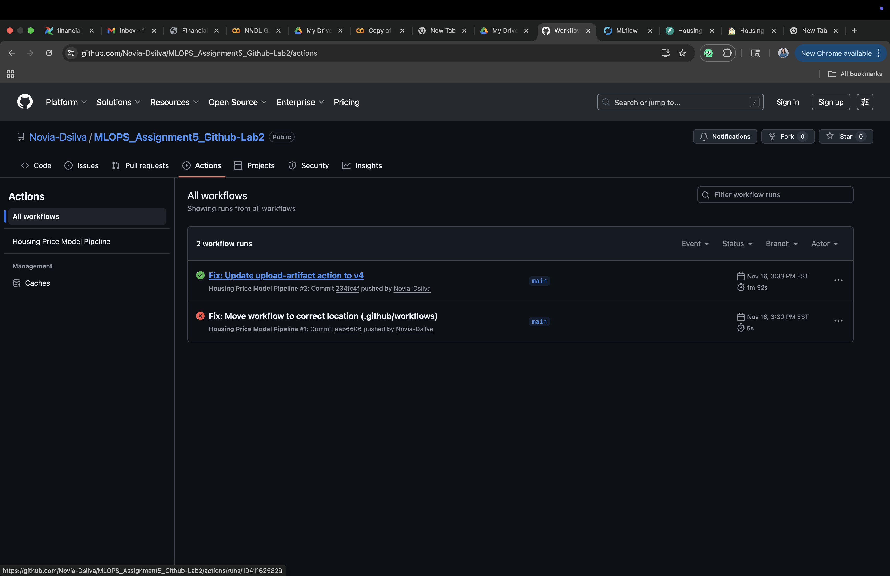
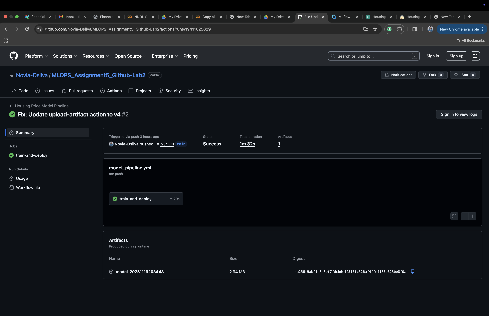
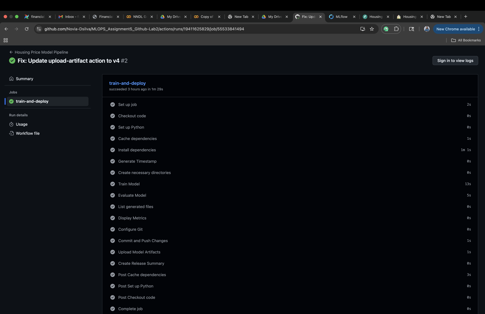
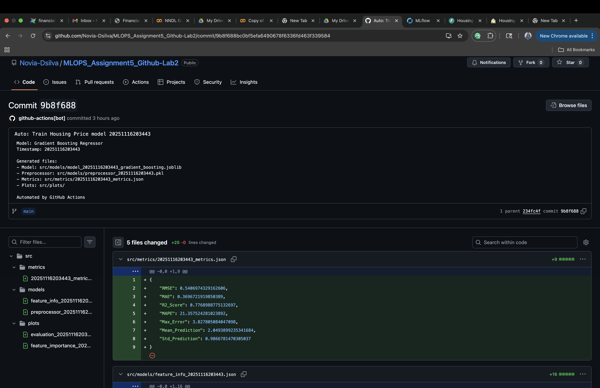
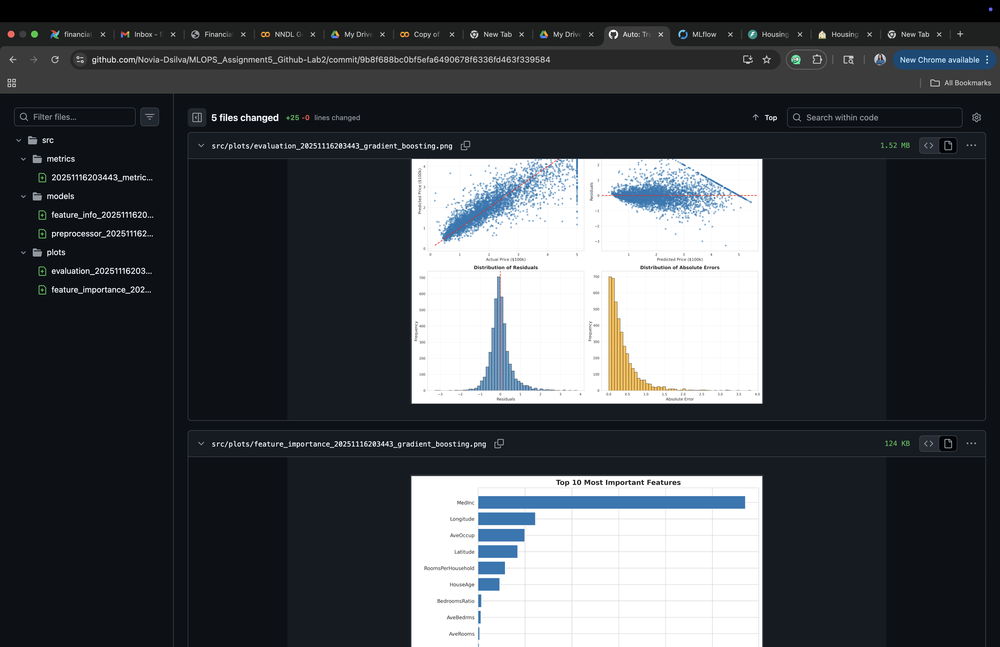
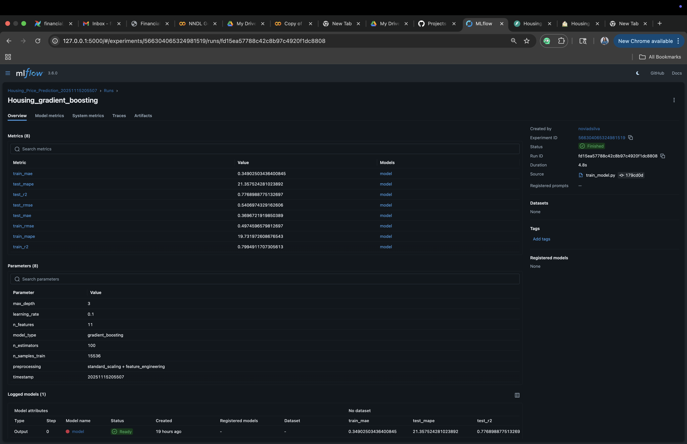
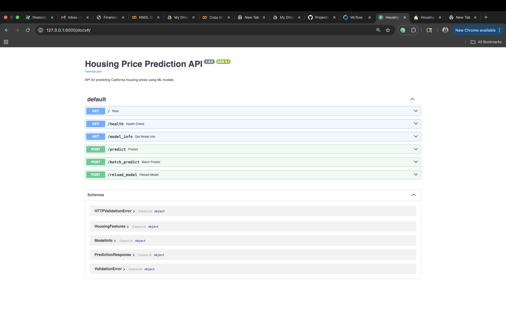
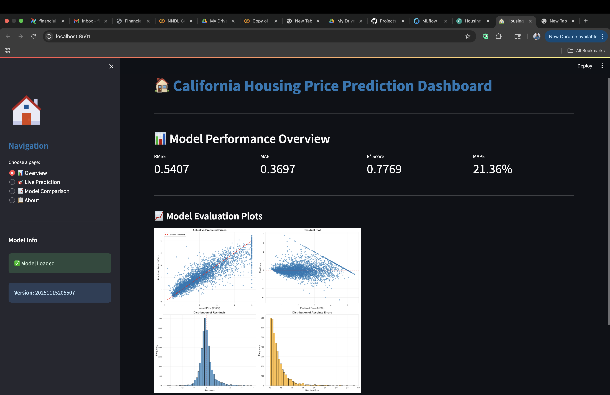
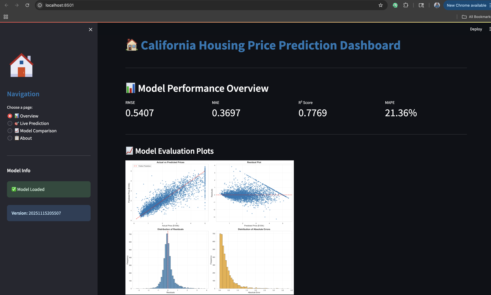

# Using GitHub Actions for Model Training and Versioning for California Housing Price Prediction

[](https://github.com/Novia-Dsilva/MLOPS_Assignment5_Github-Lab2/actions/workflows/model_pipeline.yml)

A production-ready MLOps pipeline demonstrating end-to-end machine learning workflow automation using GitHub Actions, MLflow, FastAPI, and Streamlit for California housing price prediction.

---

## Project Overview

This project showcases a **complete MLOps pipeline** for predicting California housing prices. Unlike traditional ML projects, this implementation emphasizes:

- **Automated Training**: GitHub Actions triggers model training on every push
- **Experiment Tracking**: MLflow logs all experiments, parameters, and metrics
- **Model Serving**: FastAPI provides REST endpoints for predictions
- **Interactive Dashboard**: Streamlit enables real-time predictions and visualization
- **Version Control**: Every model is versioned with timestamps
- **CI/CD Integration**: Full automation from training to deployment

### Dataset

**California Housing Dataset** (from scikit-learn)
- **Source**: 1990 California census data
- **Samples**: 20,640 observations
- **Features**: 8 numerical features
  - `MedInc`: Median income in block group
  - `HouseAge`: Median house age in block group
  - `AveRooms`: Average number of rooms per household
  - `AveBedrms`: Average number of bedrooms per household
  - `Population`: Block group population
  - `AveOccup`: Average number of household members
  - `Latitude`: Block group latitude
  - `Longitude`: Block group longitude
- **Target**: Median house value (in $100,000s)

---

## What's New in This Implementation

This project significantly extends the original GitHub Actions lab with the following enhancements:

### 1. **Real-World Dataset** 
- **Original**: Synthetic data generated using `make_classification`
- **New**: Real California Housing dataset with actual economic and geographic features
- **Impact**: More meaningful predictions and realistic model evaluation

### 2. **Advanced Model Architecture** 
- **Original**: Random Forest Classifier
- **New**: Gradient Boosting Regressor with hyperparameter tuning
- **Additions**:
  - Feature engineering (3 new engineered features)
  - Standard scaling for numerical features
  - Outlier detection and handling
  - Model versioning with timestamps

### 3. **MLflow Integration** 
- **New Addition**: Complete experiment tracking system
- **Features**:
  - Automatic logging of parameters, metrics, and artifacts
  - Model registry with versioning
  - Experiment comparison capabilities
  - Web UI for visualization (accessible at `localhost:5000`)
- **Metrics Tracked**: RMSE, MAE, R², MAPE

### 4. **FastAPI Model Serving** 
- **New Addition**: Production-ready REST API
- **Endpoints**:
  - `POST /predict`: Single prediction
  - `POST /batch_predict`: Batch predictions
  - `GET /model_info`: Model metadata
  - `GET /health`: Health check
  - `POST /reload_model`: Reload latest model
- **Features**:
  - Automatic API documentation (Swagger UI)
  - Input validation with Pydantic
  - Error handling and logging

### 5. **Interactive Streamlit Dashboard** 
- **New Addition**: User-friendly web interface
- **Pages**:
  - **Overview**: Model performance metrics and visualizations
  - **Live Prediction**: Interactive form for real-time predictions
  - **Model Comparison**: Compare different model versions
  - **About**: Project documentation
- **Visualizations**:
  - Performance metrics over time
  - Actual vs Predicted plots
  - Residual analysis
  - Feature importance charts

### 6. **Comprehensive Evaluation** 
- **Original**: F1 Score only
- **New**: Multiple regression metrics
  - RMSE (Root Mean Squared Error)
  - MAE (Mean Absolute Error)
  - R² Score (Coefficient of Determination)
  - MAPE (Mean Absolute Percentage Error)
- **Visualizations**:
  - Evaluation plots with 4 subplots
  - Feature importance visualization
  - Residual distribution analysis

### 7. **Enhanced GitHub Actions Workflow** 
- **Improvements**:
  - Detailed step-by-step logging
  - Artifact upload (models, metrics, plots)
  - Performance summary in workflow
  - Better error handling
  - Caching for faster builds
  - Retention policy for artifacts (30 days)

### 8. **Data Preprocessing Pipeline** 
- **New Addition**: Modular preprocessing system
- **Components**:
  - Data loader module
  - Feature engineering module
  - Scaling and normalization
  - Train/test split with stratification
  - Data validation

---

## Tech Stack

### Machine Learning
- **scikit-learn**: Model training and preprocessing
- **pandas**: Data manipulation
- **numpy**: Numerical computations

### MLOps Tools
- **MLflow**: Experiment tracking and model registry
- **GitHub Actions**: CI/CD automation

### API & Deployment
- **FastAPI**: REST API framework
- **Uvicorn**: ASGI server
- **Pydantic**: Data validation

### Visualization
- **Streamlit**: Interactive dashboard
- **Plotly**: Interactive charts
- **Matplotlib & Seaborn**: Statistical visualizations

### Development
- **Python 3.9**: Programming language
- **Git**: Version control
- **pytest**: Testing framework

---

## Project Structure


```
MLOPS_Assignment5_Github-Lab2/
├── .github/
│   └── workflows/
│       └── model_pipeline.yml          # GitHub Actions workflow
│
├── src/
│   ├── __init__.py
│   ├── data_loader.py                  # Data loading utilities
│   ├── preprocessing.py                # Feature engineering & scaling
│   ├── train_model.py                  # Model training script
│   ├── evaluate_model.py               # Model evaluation script
│   ├── model_utilis.py                 # Helper functions
│   │
│   ├── data/                           # Processed data
│   │   ├── X_train.pkl
│   │   ├── X_test.pkl
│   │   ├── y_train.pkl
│   │   └── y_test.pkl
│   │
│   ├── models/                         # Trained models
│   │   ├── model_{timestamp}_gradient_boosting.joblib
│   │   ├── preprocessor_{timestamp}.pkl
│   │   └── feature_info_{timestamp}.json
│   │
│   ├── metrics/                        # Evaluation metrics
│   │   └── {timestamp}_metrics.json
│   │
│   └── plots/                          # Visualizations
│       ├── evaluation_{timestamp}_gradient_boosting.png
│       └── feature_importance_{timestamp}_gradient_boosting.png
│
├── api/
│   ├── __init__.py
│   ├── main.py                         # FastAPI application
│   └── schemas.py                      # Pydantic models
│
├── dashboard/
│   └── app.py                          # Streamlit dashboard
│
├── screenshots/                        # Documentation screenshots
│
├── mlruns/                             # MLflow tracking directory
│
├── requirements.txt                    # Python dependencies
├── .gitignore                          # Git ignore rules
└── README.md                           # This file

```

---

## Getting Started

### Prerequisites

- Python 3.9 or higher
- Git
- GitHub account
- Virtual environment (recommended)

### Installation

1. **Clone the repository**
   ```bash
   git clone https://github.com/Novia-Dsilva/MLOPS_Assignment5_Github-Lab2.git
   cd MLOPS_Assignment5_Github-Lab2
   ```

2. **Create virtual environment**
   ```bash
   python -m venv venv
   
   # Activate on macOS/Linux
   source venv/bin/activate
   
   # Activate on Windows
   venv\Scripts\activate
   ```

3. **Install dependencies**
   ```bash
   pip install -r requirements.txt
   ```

### Local Usage

#### 1. Train the Model

```bash
cd src
python train_model.py --timestamp $(date '+%Y%m%d%H%M%S') --model_type gradient_boosting
```

**Parameters:**
- `--timestamp`: Unique identifier for model version
- `--model_type`: Type of model (gradient_boosting or ridge)
- `--n_estimators`: Number of boosting stages (default: 100)
- `--learning_rate`: Learning rate (default: 0.1)
- `--max_depth`: Maximum depth of trees (default: 3)

#### 2. Evaluate the Model

```bash
python evaluate_model.py --timestamp <your_timestamp> --model_type gradient_boosting
```

This generates:
- Performance metrics (JSON)
- Evaluation plots (PNG)
- Feature importance chart (PNG)

#### 3. Start MLflow UI

```bash
mlflow ui --backend-store-uri ./mlruns --port 5000
```
Open browser: http://localhost:5000

#### 4. Launch FastAPI Server

```bash
uvicorn api.main:app --reload --port 8000
```

Open browser: http://localhost:8000/docs


#### 5. Run Streamlit Dashboard

```bash
streamlit run dashboard/app.py
```

Open browser: http://localhost:8501

---

## Model Performance

### Latest Model Metrics

| Metric | Training | Test | Description |
|--------|----------|------|-------------|
| **RMSE** | 0.4975 | 0.5407 | Root Mean Squared Error (lower is better) |
| **MAE** | 0.3490 | 0.3697 | Mean Absolute Error (lower is better) |
| **R² Score** | 0.7995 | 0.7769 | Coefficient of Determination (higher is better) |
| **MAPE** | 19.73% | 21.36% | Mean Absolute Percentage Error |


---

## Dashboard Features

### 1. Overview Page 

**Key Metrics Display:**
- RMSE, MAE, R², MAPE in metric cards
- Delta indicators showing improvement from previous version
- Interactive line charts showing metrics over time

**Visualizations:**
- Model performance trends
- Evaluation plots (Actual vs Predicted, Residuals)
- Feature importance charts

### 2. Live Prediction Page 

**Interactive Input Form:**
- 8 input fields for housing features
- Sliders and number inputs with validation
- Real-time prediction on button click

**Results Display:**
- Predicted price in $100k units
- Predicted price in USD format
- Model confidence score
- Celebration animation on successful prediction

### 3. Model Comparison Page 

**Comparison Features:**
- Best performing model identification
- Latest model metrics
- Detailed comparison table
- Color-coded performance indicators

**Summary Statistics:**
- Best R² score across all versions
- Model version history
- Performance trends

### 4. About Page 

**Documentation:**
- Project overview
- Technology stack
- Dataset information
- Model details
- Usage instructions

---

## API Documentation

### Base URL
```
http://localhost:8000
```

### Endpoints

#### 1. Health Check
```http
GET /health
```

**Response:**
```json
{
  "status": "healthy",
  "model_loaded": true,
  "model_info": {
    "model_version": "...",
    "model_type": "gradient_boosting",
    "timestamp": "20251116..."
  }
}
```

#### 2. Model Information
```http
GET /model_info
```

**Response:**
```json
{
  "model_version": "src/models/model_..._gradient_boosting.joblib",
  "model_type": "gradient_boosting",
  "timestamp": "20251116...",
  "n_features": 11,
  "available_models": [...]
}
```

#### 3. Single Prediction
```http
POST /predict
```

**Request Body:**
```json
{
  "MedInc": 3.5,
  "HouseAge": 25.0,
  "AveRooms": 5.5,
  "AveBedrms": 1.2,
  "Population": 1200.0,
  "AveOccup": 3.0,
  "Latitude": 34.05,
  "Longitude": -118.25
}
```

**Response:**
```json
{
  "predicted_price": 2.15,
  "predicted_price_usd": 215000.0,
  "model_version": "src/models/model_..._gradient_boosting.joblib",
  "model_type": "gradient_boosting"
}
```

#### 4. Batch Prediction
```http
POST /batch_predict
```

**Request Body:**
```json
{
  "features": [
    {
      "MedInc": 3.5,
      "HouseAge": 25.0,
      ...
    },
    {
      "MedInc": 4.2,
      "HouseAge": 30.0,
      ...
    }
  ]
}
```

**Response:**
```json
{
  "predictions": [
    {
      "predicted_price": 2.15,
      "predicted_price_usd": 215000.0,
      ...
    },
    ...
  ],
  "count": 2
}
```

#### 5. Reload Model
```http
POST /reload_model
```

Reloads the latest trained model without restarting the server.

---

## GitHub Actions Workflow

### Workflow Trigger

The workflow automatically triggers on:
- Push to `main` branch
- Manual trigger via "Run workflow" button

### Workflow Steps

1. **Setup Environment**
   - Checkout code
   - Setup Python 3.9
   - Cache dependencies
   - Install requirements

2. **Generate Timestamp**
   - Create unique version identifier
   - Store for model versioning

3. **Train Model**
   - Load California Housing dataset
   - Preprocess and engineer features
   - Train Gradient Boosting model
   - Log to MLflow

4. **Evaluate Model**
   - Calculate metrics (RMSE, MAE, R², MAPE)
   - Generate evaluation plots
   - Create feature importance chart

5. **Store Artifacts**
   - Save model files
   - Save preprocessor
   - Save metrics JSON
   - Save visualization plots

6. **Commit Results**
   - Configure git
   - Add model files, metrics, plots
   - Commit with detailed message
   - Push back to repository

7. **Upload Artifacts**
   - Create downloadable artifact package
   - Set 30-day retention period
   - Include models, metrics, plots

8. **Generate Summary**
   - Display performance metrics
   - Show model details
   - List generated files

### Workflow Configuration

Location: `.github/workflows/model_pipeline.yml`

```yaml
name: Housing Price Model Pipeline

on:
  push:
    branches:
      - main
  workflow_dispatch:

jobs:
  train-and-deploy:
    runs-on: ubuntu-latest
    # ... steps ...
```

### Viewing Workflow Results

1. Go to repository **Actions** tab
2. Click on latest workflow run
3. View step-by-step execution logs
4. Download artifacts
5. Check workflow summary for metrics

---

## MLflow Experiment Tracking

### Starting MLflow

```bash
mlflow ui --backend-store-uri ./mlruns --port 5000
```
---

## Screenshots

### GitHub Actions Workflow






### MLflow Dashboard


### FastAPI Documentation


### Streamlit Dashboard


---

## Deployment

### Running All Services

```bash
# Terminal 1: MLflow UI
mlflow ui --backend-store-uri ./mlruns --port 5000

# Terminal 2: FastAPI
uvicorn api.main:app --reload --port 8000

# Terminal 3: Streamlit Dashboard
streamlit run dashboard/app.py
```

### Access Points

- **MLflow UI**: http://localhost:5000
- **FastAPI Docs**: http://localhost:8000/docs
- **Streamlit Dashboard**: http://localhost:8501

---

## Testing

### Run Tests

```bash
pytest test/
```

### Manual Testing

**Test Model Training:**
```bash
cd src
python train_model.py --timestamp test_$(date '+%Y%m%d%H%M%S') --model_type gradient_boosting
```

**Test API:**
```bash
curl -X POST "http://localhost:8000/predict" \
  -H "Content-Type: application/json" \
  -d '{
    "MedInc": 3.5,
    "HouseAge": 25.0,
    "AveRooms": 5.5,
    "AveBedrms": 1.2,
    "Population": 1200.0,
    "AveOccup": 3.0,
    "Latitude": 34.05,
    "Longitude": -118.25
  }'
```

---

**Novia D'Silva**
- GitHub: [@Novia-Dsilva](https://github.com/Novia-Dsilva)
- Repository: [MLOPS_Assignment5_Github-Lab2](https://github.com/Novia-Dsilva/MLOPS_Assignment5_Github-Lab2)

---
